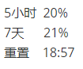

# Codex Tray Gauge ✨

一个放在 Windows 托盘里的 Codex 额度小挂件。  
不用开终端，不用手动查，瞄一眼托盘图标就知道 5 小时额度还剩多少。

## 实际效果 👀

托盘图标会用绿色圆环显示 5h 额度，Tooltip 里只放最常看的信息。




## 它能做什么 🌿

- 🟢 用托盘圆环显示 **5h 额度剩余比例**
- 🧾 Tooltip 显示 **5h / 7d / 下次重置时间**，中文数字对齐
- 🌏 支持 English / 中文
- 🔁 自动刷新，低额度时刷新更频繁
- 🪶 常驻后台很轻，平时基本不占资源
- 🔒 只和本机 `codex app-server` 通信，不自己联网

## 使用方式 🚀

1. 安装并登录 Codex

2. 运行：

```text
codex-tray-gauge.exe
```

3. 右键托盘图标可以：

- 立即刷新
- 复制状态
- 切换语言
- 退出

## 开机启动 🌅

想让它跟着 Windows 自动启动，右键 PowerShell 运行：

```powershell
.\install-startup.ps1
```

想取消开机启动：

```powershell
.\uninstall-startup.ps1
```

## 构建 🛠️

最简单的方式：双击 `build.bat`。

它会自动编译 Release，并把新的 `codex-tray-gauge.exe` 放到项目根目录。  
项目已经带了需要的 JSON 头文件，重新生成 `build` 文件夹时不需要临时联网下载依赖。

也可以手动构建：

```powershell
cmake -S . -B build -G "Ninja" -DCMAKE_BUILD_TYPE=Release
cmake --build build --config Release
```

## 隐私 🔐

这个工具尽量保持安静：

- 不读取浏览器 cookie
- 不读取 `~/.codex/auth.json`
- 不保存额度、token、prompt 或 response
- 不写日志
- 不主动发 HTTP 请求

它只保存一个设置：界面语言。

```text
HKCU\Software\CodexTrayGauge\Language
```

额度数据只在内存里，退出后就没了。

## 安全 🧯

如果发现安全问题，请优先使用 GitHub Security Advisory。  
不要在公开 issue 里贴 token、日志或账号信息。

## License 📄

MIT. 随便用，保留版权声明即可。
